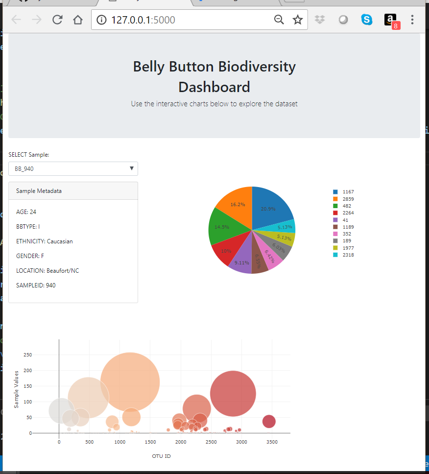

# Belly Button Biodiversity

This project contains an interactive dashboard detailing information about belly button microbes.

Data was pulled from a sqlite file into multiple API routes using Flask. Then, Plotly was used to display the data in a dashboard type format. Javascript dropdowns were added to increase the functionality.

